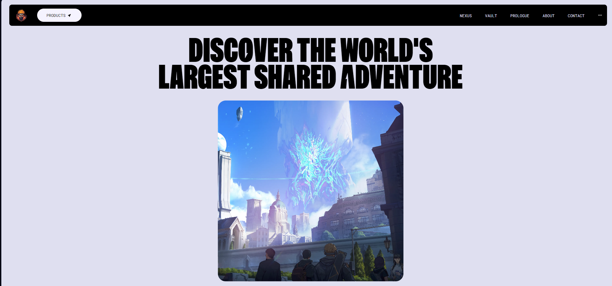
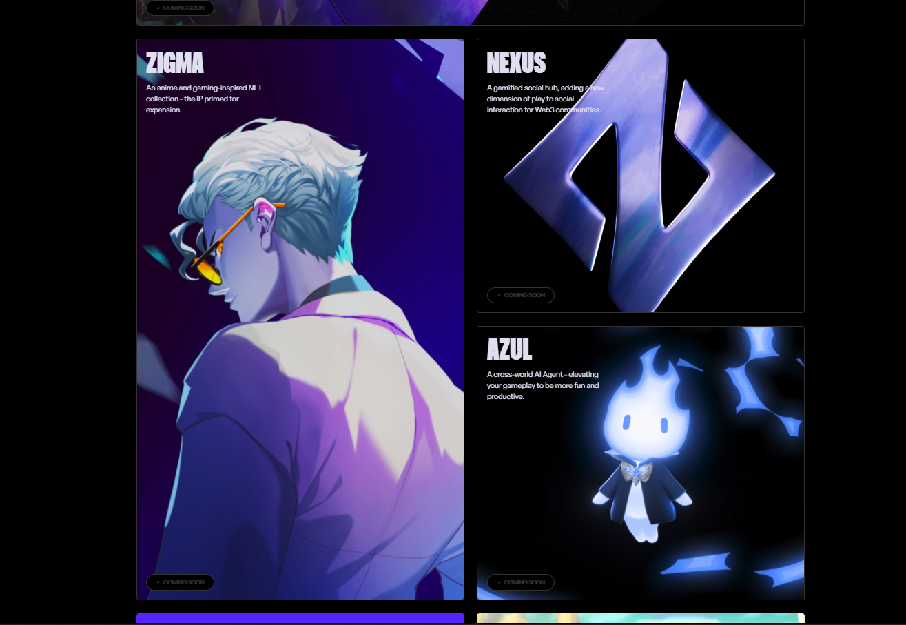
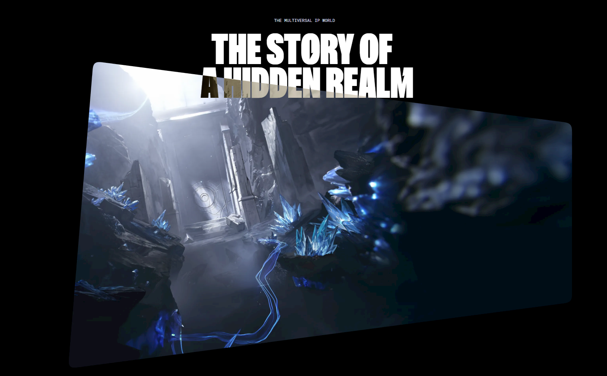
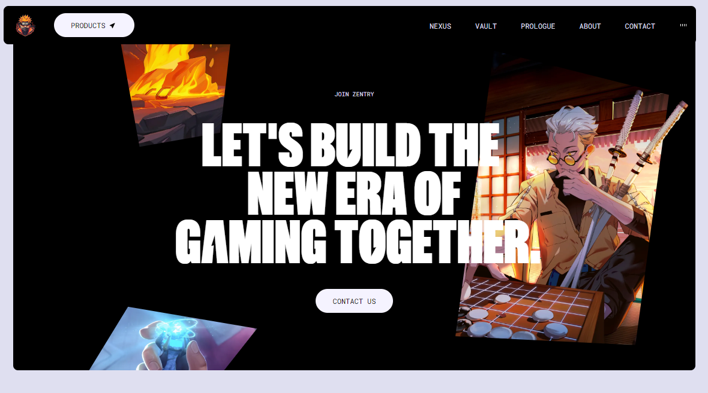

# GameWeb
# Floating Interactive Webpage with GSAP Animations

This project showcases a visually engaging and interactive webpage built with React, leveraging GSAP for animations and transitions. The page includes animated titles, a floating image effect, a responsive navigation bar, and a dynamic video section.

---

## Features

### Dynamic Navbar
- Appears/disappears based on scroll direction using React state and GSAP.
- Includes interactive navigation links and a toggleable audio indicator.

### Floating Image Effect
- Real-time tilt effect on mouse movement.
- Smooth reset animations when the cursor leaves the image, powered by GSAP.

### Hero Section
- Dynamic video transitions controlled by user interaction.
- Animated scroll-based effects on the video frame for an immersive experience.

### Animated Titles
- Text animations that react to scroll triggers.
- Styled titles to enhance visual storytelling.

### Reusable Components
- `Button` and `AnimatedTitle` components for modular and scalable design.
- `BentoCard` and `BentoTilt` components to highlight additional features.

### SVG Filters and Rounded Masks
- Adds subtle design enhancements for modern aesthetics.

### Mobile-Responsive Design
- Ensures compatibility and functionality across devices of all sizes.

---

## Tech Stack

- **React:** Component-based architecture for building UI.
- **GSAP:** Animation library for creating smooth, high-performance interactions.
- **TypeScript:** Strong typing for better maintainability and development experience.
- **CSS:** Custom styles with TailwindCSS-like utility classes.

---

## Screenshots

### Hero

### About

### Animated Cards

### Story

### Contact

